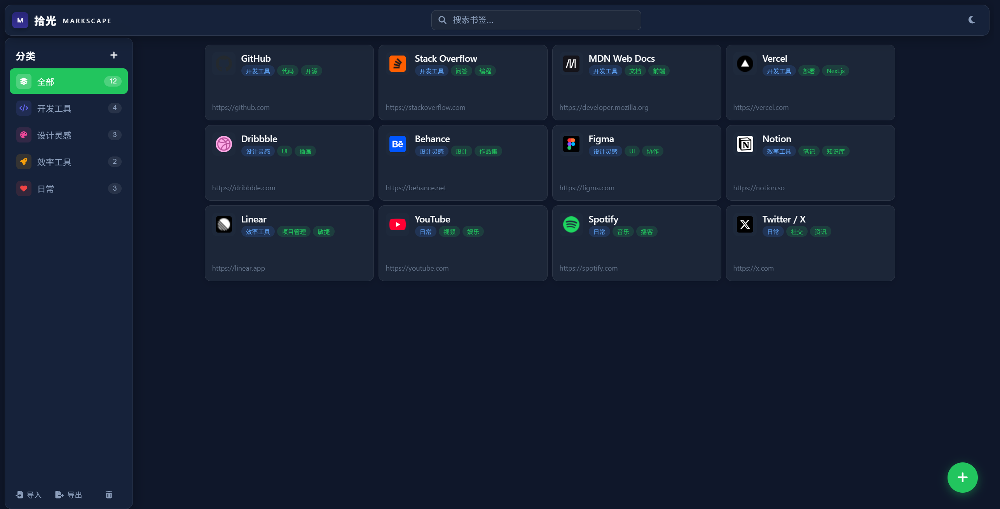
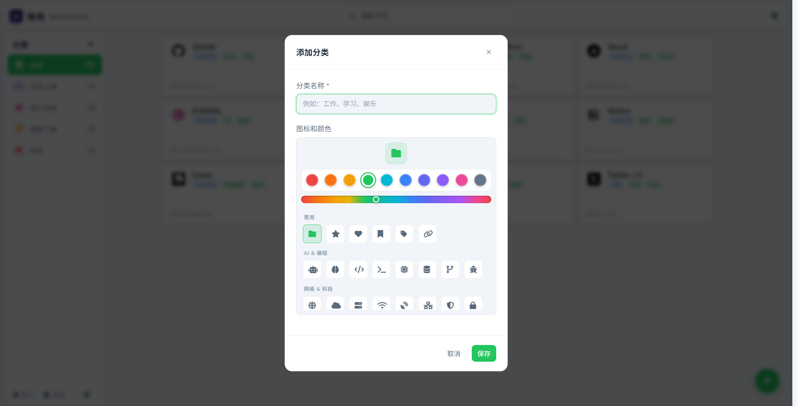
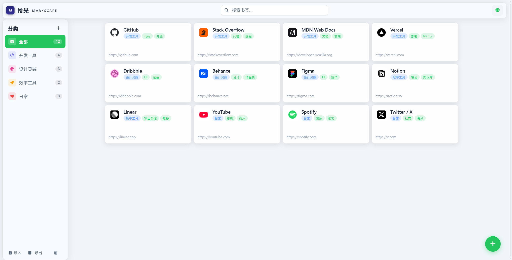
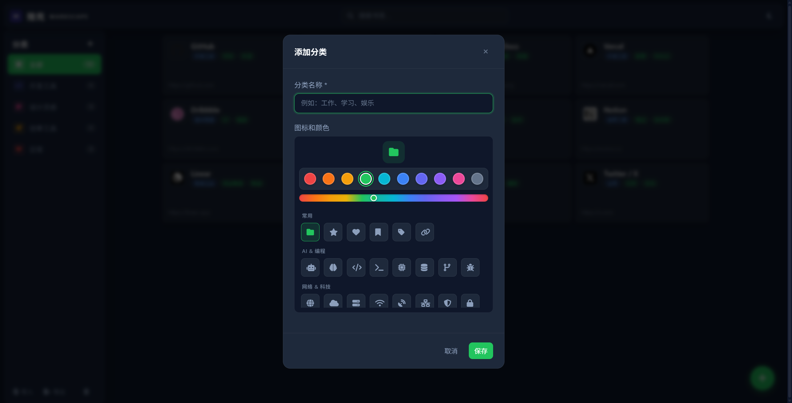

<p align="center">
  <a href="https://github.com/Ekko7778/markscape/blob/main/logo.png" target="_blank"></a>
</p>

<h1 align="center">拾光 Markscape</h1>

<p align="center">
  极简书签管理器 — 收集你的光
</p>

<p align="center">
  
  
  
  
  
</p>

<p align="center">
  <a href="#功能特性">功能特性</a> · <a href="#预览">预览</a> · <a href="#快速开始">快速开始</a> · <a href="#技术栈">技术栈</a>
</p>

---

## 功能特性

- **分类管理** — 自定义分类，支持图标和颜色自定义
- **书签收藏** — 添加、编辑、删除书签，支持拖拽排序
- **快速保存** — 快捷键一键保存当前页面
- **实时搜索** — 即时过滤，快速定位书签
- **深色/浅色主题** — 跟随系统或手动切换，防闪屏
- **数据持久化** — localStorage 本地存储，无需后端
- **响应式布局** — 适配桌面和移动端
- **Liquid Glass 风格** — 磨砂玻璃质感 UI

## 预览

> 点击图片查看大图

### 主界面

<table>
  <tr>
    <td align="center"><a href="https://github.com/Ekko7778/markscape/blob/main/screenshots/screenshot-dark-main.png" target="_blank"></a><br><sub>深色主题</sub></td>
    <td align="center"><a href="https://github.com/Ekko7778/markscape/blob/main/screenshots/screenshot-light-main.png" target="_blank"></a><br><sub>浅色主题</sub></td>
  </tr>
</table>

### 分类编辑器 — 图标选择器 & 渐变取色条

<table>
  <tr>
    <td align="center"><a href="https://github.com/Ekko7778/markscape/blob/main/screenshots/screenshot-dark-category.png" target="_blank"></a><br><sub>深色主题</sub></td>
    <td align="center"><a href="https://github.com/Ekko7778/markscape/blob/main/screenshots/screenshot-light-category.png" target="_blank"></a><br><sub>浅色主题</sub></td>
  </tr>
</table>

<h1 align="center">拾光 Markscape</h1>

<p align="center">
  极简书签管理器 — 收集你的光
</p>

<p align="center">
  
  
  
  
  
</p>

<p align="center">
  <a href="#功能特性">功能特性</a> · <a href="#预览">预览</a> · <a href="#快速开始">快速开始</a> · <a href="#技术栈">技术栈</a>
</p>

---

## 功能特性

- **分类管理** — 自定义分类，支持图标和颜色自定义
- **书签收藏** — 添加、编辑、删除书签，支持拖拽排序
- **快速保存** — 快捷键一键保存当前页面
- **实时搜索** — 即时过滤，快速定位书签
- **深色/浅色主题** — 跟随系统或手动切换，防闪屏
- **数据持久化** — localStorage 本地存储，无需后端
- **响应式布局** — 适配桌面和移动端
- **Liquid Glass 风格** — 磨砂玻璃质感 UI

## 预览

> 点击图片查看大图

### 主界面

<table>
  <tr>
    <td align="center"><a href="https://github.com/Ekko7778/markscape/blob/main/screenshot-dark-main.png" target="_blank"></a><br><sub>深色主题</sub></td>
    <td align="center"><a href="https://github.com/Ekko7778/markscape/blob/main/screenshot-light-main.png" target="_blank"></a><br><sub>浅色主题</sub></td>
  </tr>
</table>

### 分类编辑器 — 图标选择器 & 渐变取色条

<table>
  <tr>
    <td align="center"><a href="https://github.com/Ekko7778/markscape/blob/main/screenshot-dark-category.png" target="_blank"></a><br><sub>深色主题</sub></td>
    <td align="center"><a href="https://github.com/Ekko7778/markscape/blob/main/screenshot-light-category.png" target="_blank"></a><br><sub>浅色主题</sub></td>
  </tr>
</table>

## 快速开始

无需安装任何依赖，直接打开即可使用：

```bash
# 克隆项目
git clone https://github.com/Ekko7778/shuqian002.git

# 用浏览器打开
open index.html
```

或直接在浏览器中打开 `index.html` 文件。

## 技术栈

| 技术 | 用途 |
|:-----|:-----|
| HTML5 | 页面结构 |
| CSS3 | 样式 + 动画 + 磨砂玻璃效果 |
| Vanilla JavaScript | 交互逻辑 |
| Font Awesome 6 | 图标库 |
| localStorage | 数据持久化 |

## 项目结构

```
markscape/
├── index.html                    # 主页面（HTML + CSS）
├── app.js                        # 应用逻辑
├── logo.png                      # 应用图标
├── screenshots/                  # 界面截图
│   ├── screenshot-dark-main.png
│   ├── screenshot-light-main.png
│   ├── screenshot-dark-category.png
│   └── screenshot-light-category.png
└── README.md                     # 说明文档
```

## License

[MIT](LICENSE)
